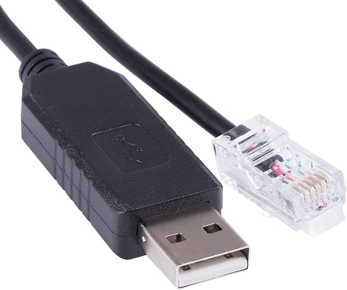

# SerialRenogy

A NodeJS utility to retrieve data from a Renogy solar controllers via RS-232 and serve it as a Prometheus metrics endpoint for display in Grafana.


> [!NOTE]
> This software provides read-only access to your solar controller; you can not change any parameters with this software.

This software is licensed under the [MIT License](https://opensource.org/licenses/MIT).


## Thanks

Most of the credit for this goes to [sophienyaa](https://github.com/sophienyaa) for her [NodeRenogy](https://github.com/sophienyaa/NodeRenogy) project, on which this is _heavily_ based.  If you would prefer to publish data to MQTT instead of scraping via Prometheus, use that one.

From [sophienyaa/NodeRenogy](https://github.com/sophienyaa/NodeRenogy):
> Thanks to [menloparkinnovation](https://github.com/menloparkinnovation) the for [renogy-rover](https://github.com/menloparkinnovation/renogy-rover) that inspired this software.
> 
> Thanks to the [Renogy boards](https://renogy.boards.net/thread/266/rover-modbus) for the Protocol docs.
> 
> Thanks to the [solaranzeige.de boards](https://solaranzeige.de/phpBB3/viewtopic.php?t=693) for pinout information.


## Requirements & Assumptions

1. I have personally tested this with the [Renogy Rover 20A MPPT](https://www.renogy.com/rover-li-20-amp-mppt-solar-charge-controller/) and the [Renogy Wanderer 10A PWM](https://www.renogy.com/wanderer-10a-pwm-charge-controller/) controllers.  I assume this will work with any Renogy solar controller with an RS-232 or RS-485 port.

2. A [Raspberry Pi Zero 2 W](https://www.raspberrypi.com/products/raspberry-pi-zero-2-w/) is _perfect_ for this -- it's small, low power, very affordable, and plenty powerful to run SerialRenogy.  Although, any SBC/PC with a serial (RS-232) port, or an available USB port for adding a USB-to-serial dongle.

3. Linux is recommended.  Although SerialRenogy is a NodeJS app, and NodeJS does run on Windows, it hasn't been tested -- if you use Windows, you're on your own.

4. It is assumed that you already have an instance of Prometheus and Grafana running.  If not, it is feasible to set those up on the same device as SerialRenogy, however, that procedure is beyond the scope of this guide.

5. It is assumed that you have at least basic experience with general electronics and wiring -- this guide will provide information on making your own serial cable, but it is not a step-by-step component sourcing and assembly guide.


## Supported Registers

As of August 2023, this utility supports all known data fields available in the Renogy controller per their own documentation.  A copy of this document is available in [reference/renogy-serial-protocol.pdf](reference/renogy-serial-protocol.pdf) for reference.

> [!NOTE]
> I assume it's okay to share it here since it was originally posted in [a public forum](https://renogy.boards.net/post/1939/thread) by a Renogy employee.

### Device information:

| Register      | Description                         | Unit |
| :------------ | :---------------------------------- | :--: |
| 0x00A         | Controller voltage rating           | V    |
| 0x00A         | Controller current rating           | A    |
| 0x00B         | Controller discharge current rating | A    |
| 0x00B         | Controller type                     | -    |
| 0x00C - 0x013 | Controller model name               | -    |
| 0x014 - 0x015 | Controller software version         | -    |
| 0x016 - 0x017 | Controller hardware version         | -    |
| 0x018 - 0x019 | Controller serial number            | -    |
| 0x01A         | Controller MODBUS address           | -    |


### Energy data:

| Register       | Description                                                                                                | Unit  |
| :------------- | :--------------------------------------------------------------------------------------------------------- | :---: |
| 0x100          | Battery Capacity                                                                                           |     % |
| 0x101          | Battery Voltage                                                                                            |     V |
| 0x102          | Battery Charge Current                                                                                     |     A |
| 0x103          | Battery Temperature                                                                                        |    °C |
| 0x103          | Controller Temperature                                                                                     |    °C |
| 0x104          | Load Voltage                                                                                               |     V |
| 0x105          | Load Current                                                                                               |     A |
| 0x106          | Load Power                                                                                                 |     W |
| 0x107          | Solar Panel Voltage                                                                                        |     V |
| 0x108          | Solar Panel Current                                                                                        |     A |
| 0x109          | Solar Panel Power                                                                                          |     W |
| 0x10B          | Min Battery Voltage Today                                                                                  |     V |
| 0x10C          | Min Battery Voltage Today                                                                                  |     V |
| 0x10D          | Max Charge Current Today                                                                                   |     A |
| 0x10E          | Max Discharge Current Today                                                                                |     A |
| 0x10F          | Max Charge Power Today                                                                                     |     W |
| 0x110          | Max Discharge Power Today                                                                                  |     W |
| 0x111          | Charge Amp-hours Today                                                                                     |    Ah |
| 0x112          | Discharge Amp-hours Today                                                                                  |    Ah |
| 0x113          | Charge Watt-hours Today                                                                                    |    Wh |
| 0x114          | Discharge Watt-hours Today                                                                                 |    Wh |
| 0x115          | Controller Uptime                                                                                          |  Days |
| 0x116          | Total Battery Over-charges                                                                                 | Count |
| 0x117          | Total Battery Full Charges                                                                                 | Count |
| 0x118<br>0x119 | Total Battery Charging Amp-hours                                                                           |    Ah |
| 0x11A<br>0x11B | Total Battery Discharging Amp-hours                                                                        |    Ah |
| 0x11C<br>0X11D | Cumulative power generation                                                                                |   kWh |
| 0x11E<br>0x11F | Cumulative power consumption                                                                               |   kWh |
| 0x120          | 1. Street Light Status<br>2. Street Light Brightness<br>3. Charging State<br>_See notes below for details_ |   -   |
| 0x121<br>0x122 | Faults<br>_See notes below for details_                                                                    |   -   |

### "Street Light" Status and Brightness

The term "street light" just means load, except brightness refers to a 0-100% output, which would only be used if the load were a light.  Most users will probably ignore the brightness field and just focus on the load status, which will be either on or off.


### Charging State

The charging state will be one of these values, based on the solar power coming in and current battery level.  Some of these may not apply, depending on whether you have a PWM or a MPPT controller.

| Value | Status               |
|:-----:|:---------------------|
|   0   | Charging Deactivated |
|   1   | Charging Activated   |
|   2   | MPPT                 |
|   3   | Equalizing           |
|   4   | Boost                |
|   5   | Floating             |
|   6   | Current Limiting     |


### Faults

There are currently 15 possible fault conditions, listed below:

|  Bit | Fault                                  |
|-----:|:---------------------------------------|
| 0-15 | reserved                               |
|   16 | Battery over-discharge                 |
|   17 | Battery over-voltage                   |
|   18 | Battery under-voltage warning          |
|   19 | Load short-circuit                     |
|   20 | Load over-power or over-current        |
|   21 | Controller temperature too high        |
|   22 | Ambient temperature too high           |
|   23 | Solar input over-power                 |
|   24 | Solar input short-circuit              |
|   25 | Solar input over-voltage               |
|   26 | Solar panel counter-current            |
|   27 | Solar panel working point over-voltage |
|   28 | Solar input reverse-wired              |
|   29 | MOS anti-reverse shorted               |
|   30 | MOS charge circuit shorted             |
|   31 | reserved                               |

For each one of these:
- `0` -> normal
- `1` -> triggered 

The current version of this utility does not distinguish which faults are active, it only asserts whether one is set or none at all.  An upcoming version will break these out individually.


## Connecting the Controller

Renogy controllers use either RS-232 or RS-485 for serial communications, so you will need an interface that supports the protocol your controller uses. 

If you're using a standard computer for this, and it has a RS-232 port (usually a DB-9 or DB-25 connector), you're golden.  If not, or if you're using a SBC like a Raspberry Pi or similar, you can use a USB-to-serial dongle -- these are plentiful on Amazon and AliExpress, just make sure you get one with a well-known chip from FTDI.

> [!CAUTION]
> The UART pins found on Raspberry Pi's, microcontrollers, etcetera are TTL-serial, which is **not** the same as RS-232.  TTL voltages will be at the host VCC level (3.3 or 5 volts), while RS-232 can be as large as -25V to +25V (although most PCs might be in the -13V to +13V) -- connect RS-232 directly to the UART pins on your Pi or microcontroller and it's likely that you'll [let out the magic smoke](https://en.wikipedia.org/wiki/Magic_smoke)!

Actually, there _is_ a way to use the UART pins on your Raspberry Pi instead of plugging in a USB-to-serial dongle by wiring a RS232-to-TTL converter, which uses a MAX3232 chip to safely convert the signal levels (here's one on [Amazon](https://amzn.to/3sKNYlJ)).  Wiring this up is simple, but I'm not going to cover it in this guide.


### Do I have to make my own serial cable?

 Rumor has it that Renogy used to offer a USB-to-serial cable with a properly wired RJ12 connector, but it is no longer available.  Building one is easy, as the components required are readily available and the information on building it can be found anywhere (such as in the section below!).

But there's some good news!  I have discovered that some third-party manufacturers/vendors are offering clones on [Amazon](https://amzn.to/3sRrTBY) and [AliExpress](https://www.aliexpress.us/item/3256803994036649.htm).  These use FTDI chips that are compatible with Windows (driver installation required) and Linux (native kernal support).


### Building a cable

The Renogy Rover and Wanderer (and other controllers with a RS-232 port) have a RJ12 jack that it uses for serial communications.

The RJ12 connector on the controller has 6 pins, with the first 3 being needed for our cable (an RJ11 jack won't work because it's missing the first pin). The remaining pins are for power, which we won't need (those are for the BT-1 and BT-2 Bluetooth modules). See the below table for the pinout.

| RJ12 Pin | DB-9 Pin | Function   |
| :------: |:--------:| :--------- |
| 1        |    2     | TX > RX    |
| 2        |    3     | RX > TX    |
| 3        |    5     | Ground     |
| 4        |          | Ground     |
| 5        |          | VCC (+15V) |
| 6        |          | VCC (+15V) |


## Using the utility

Ideally you would install/run this on a device that is connected to your solar controller all the time. I use a Raspberry Pi Zero W, which is more than powerful enough for this purpose. 

You will first need to ensure you have NodeJS v18+ installed on your device.

> [!IMPORTANT]
> If you installed a version of NodeJS via `apt-get`, please check the version with `node -v` and ensure it's at least v18 -- some distributions are known to host very old versions of NodeJS, and if that's the case for you, you'll need to uninstall it and install a more recent version manually (more information on that [here](https://github.com/nodesource/distributions)).


### Installation

1. Clone this repository:
   ```bash
   cd /opt
   git clone https://github.com/MaffooClock/SerialRenogy.git
   ```

2. Change to the directory you cloned the code into:
   ```bash
   cd /opt/SerialRenogy
    ```
3. Install NodeJS dependencies:
   ```bash
   npm install
   ```
4. Setup a global executable:
   ```bash
   sudo npm link
   ```


### Running the utility

Basic Example:
```bash
serial-renogy -s /dev/ttyUSB0
```

This would access the solar controller on serial port `/dev/ttyUSB0` and publish a simple web server on default port 9090.

This utility supports additional options as needed, please see the table below for a full list of options:

| Argument     | Alias | Description                                           | Example         | Default   |
| :----------- | :---- | :---------------------------------------------------- | :-------------- | :-------- |
| --serialport | -s    | REQUIRED: Serial port your controller is connected to | -s /dev/ttyUSB0 | None      |
| --baudrate   | -b    | The baud rate to use for serial communications        | -b 14400        | 9600      |
| --device     | -d    | The device ID (valid from 1 to 247)                   | -d 16           | 1         |
| --address    | -a    | The local interface in which to serve HTTP requests   | -a 0.0.0.0      | localhost |
| --tcpport    | -p    | The TCP port on which to serve HTTP requests          | -p 8080         | 9090      |
| --loglevel   | -l    | Sets the logging level, useful for debugging          | -l trace        | info      |
| --help       | -h    | Show help                                             |                 | -         |
| --version    | -v    | Show version number                                   |                 | -         |

These options can also be set via environment variables, by prepending `SR_` to the argument (e.g. `SR_SERIALPORT=/dev/ttyUSB0`). This is useful when running as a service (see below section).


### Running as a service

Since the main idea of this utility is for it to run all the time, a systemd service file is included.  These instructions are for Ubuntu/Debian and other distro's based on that (such as Armbian, DietPi, Raspberry Pi OS).

1. Copy the [`serial-renogy.service`](systemd/serial-renogy.service) file from the repo into `/etc/systemd/system/`.

2. Edit the new `/etc/systemd/system/serial-renogy.service` file to set environment variables as needed.

> [!IMPORTANT]
> This service will run as root since it does not specify a `User=` and `Group=`.  This could pose a security risk, so if you decide to specify a system user for this service, make sure that user is a member of the `dialout` system group so that it has access to the serial port.

3. Run the following commands:
  - To start the service:
    ```bash
    systemctl start serial-renogy
    ```
  - To check the logs/ensure it's running:
    ```bash
    journalctl -uf serial-renogy
    ```
  - To enable the service to run at startup:
    ```bash
    systemctl enable serial-renogy
    ```

> [!TIP]
> If you make changes to `/etc/systemd/system/serial-renogy.service` after it's been started or enabled, you'll need to run `systemctl daemon-reload` to refresh systemd.


## Getting data into Prometheus

It is assumed that if you're considering using this utility, and you know what Prometheus is, then you probably already know what to do.  Just add this to your `prometheus.yml`:
```yaml
scrape_configs:
   - job_name: 'serial-renogy'
     scrape_interval: 5s
     static_configs:
        - targets: [ 'raspberrypi.local:9090' ]
```

This will have Prometheus scrape the data from `http://raspberrypi.local:9090/metrics` every five seconds.  Of course, adjust the hostname (or IP address) and TCP port as necessary.


## Visualizing data in Grafana

As above, the assumption is that you know what Prometheus is, and therefore likely know what Grafana is, and thus already have your Prometheus instance configured as a data source in Grafana.  If not, there are plenty of how-to's on the web that can guide you through setting these up, such as [this one](https://grafana.com/docs/grafana/latest/getting-started/get-started-grafana-prometheus/).

If you don't already have an instance of Prometheus and Grafana running somewhere, and you're using a relatively new-ish Raspberry Pi or similar SBC with decent CPU/RAM, then you can probably run it on the same host as SerialRenogy (older Raspberry Pi devices, like the original Pi Zero W from 2017, will probably struggle).

### Dashboard
You can import the included [SerialRenogy.json](grafana/SerialRenogy.json) dashboard file into Grafana to get a good starting point.  It uses the [Sun and Moon plugin](https://grafana.com/grafana/plugins/fetzerch-sunandmoon-datasource/) to display the sun's azimuth in some of the charts to make it easy to compare power against the position of the sun, so you'll want to install that plugin first.

As I have a 20A controller with a 12V battery bank in my implementation, all the gauges are configured with that in mind.  If your system uses higher or lower voltages or current, of course you'll need to tweak the dashboard to fit.
